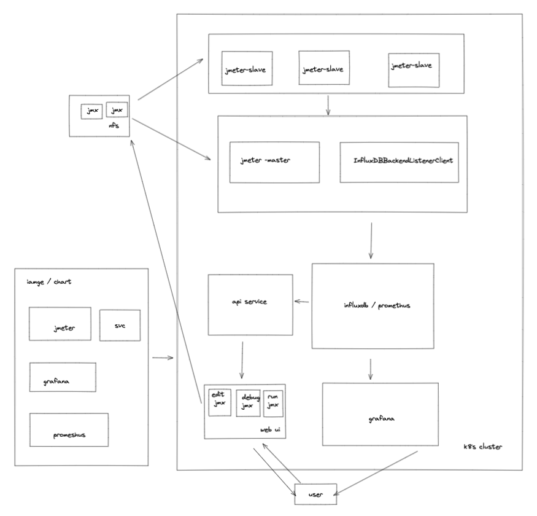
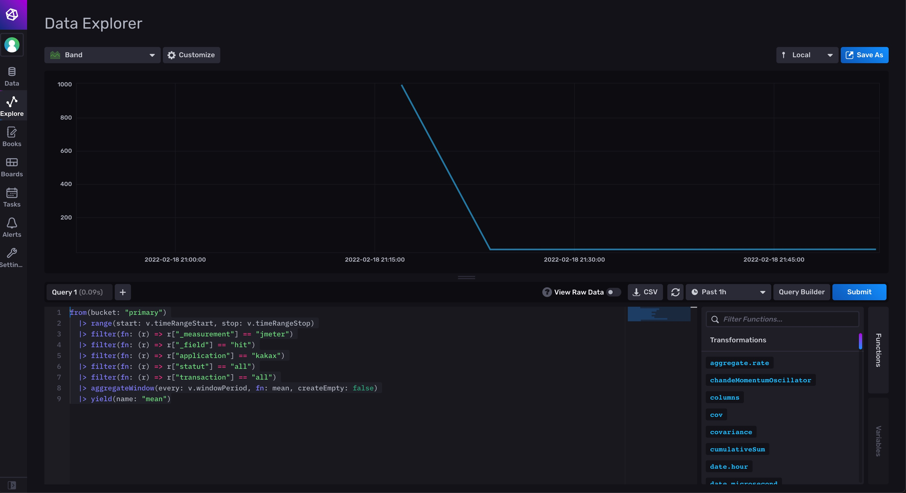
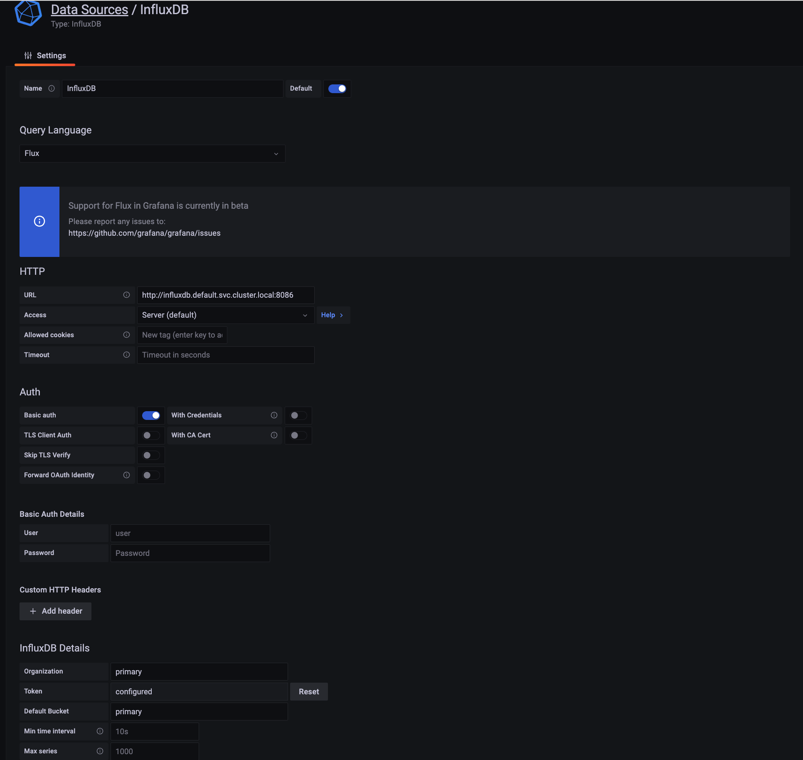

# Tink

Testing in kubernetes, make testing is easy

Distributed performance testing platform based on K8s

## architecture



## required

- [docker](https://hub.docker.com/editions/community/docker-ce-desktop-mac)
- [Kubernetes](https://zh.wikipedia.org/zh-hans/Kubernetes)
- [kubectl](https://www.kubernetes.org.cn/installkubectl)
- [helm](https://helm.sh/zh/docs/intro/install/)

## install

### create Kubernetes with [kind](https://kind.sigs.k8s.io/docs/user/quick-start/#installation)

if you have a k8s cluster, you can skip this step

```bash
git clone git@github.com:lunz1207/kakax.git
cd kakax
kind create cluster
```

### deploy kakax in to cluster

Make sure [kubeconfig](https://kubernetes.io/zh/docs/concepts/configuration/organize-cluster-access-kubeconfig) is configured correctly

```bash
git clone git@github.com:lunz1207/kakax.git
cd kakax
sh scripts/install.sh 
```

## quick start

Take kind cluster as an example

## write jmx

### InfluxBd Listener for Jmeter

<https://jmeter.apache.org/usermanual/realtime-results.html#influxdb_v2>

### upload jmx

```bash
# files service port forward
kubectl port-forward svc/svc-files 8000:8000
kubectl port-forward svc/svc-files 8001:8001

# open url and upload jmx
open http://127.0.0.1:8000

# You can confirm your file upload was successful here 
open http://127.0.0.1:8001
```

### start testing

as example, use `./jmeter/jmx/pef-test.jmx` for testing

```bash
# get jmeter-master pod name
kubectl get  pod | grep jmeter-master

# exec pod
kubectl exec -it <jmeter-master-pod-name> -- bash

# run test
/apache-jmeter-5.4.3/bin/jmeter.sh -n -t pef-test.jmx -l log.jtl -R  jmeter-slave-0.jmeter-slave.default.svc.cluster.local:1099
```

if you wanna more load ，you can scale more slave pod

```bash
kubectl scale --replicas=4 StatefulSet/jmeter-slave
```

### data explore form influxdb

```bash
# get influxdb user/password and token
echo "User: admin"
echo "Password: $(kubectl get secret influxdb --namespace default -o jsonpath="{.data.admin-user-password}" | base64 --decode)"
echo "Token: $(kubectl get secret influxdb --namespace default -o jsonpath="{.data.admin-user-token}" | base64 --decode)"

# influxdb service port forward
kubectl port-forward svc/influxdb 8086:8086

# open url
open http://127.0.0.1:8086
```



### view test data form grafana dashboard

```bash
# get grafana user/password 
echo "User: admin"
echo "Password: $(kubectl get secret grafana-admin --namespace default -o jsonpath="{.data.GF_SECURITY_ADMIN_PASSWORD}" | base64 --decode)"

# grafana service port forward
kubectl port-forward svc/grafana 3000:3000

# open url
open http://127.0.0.1:3000
```

[grafana configuration](https://jmeter.apache.org/usermanual/realtime-results.html#grafana_configuration)



## REF

[Metrics exposed](https://jmeter.apache.org/usermanual/realtime-results.html#metrics)
